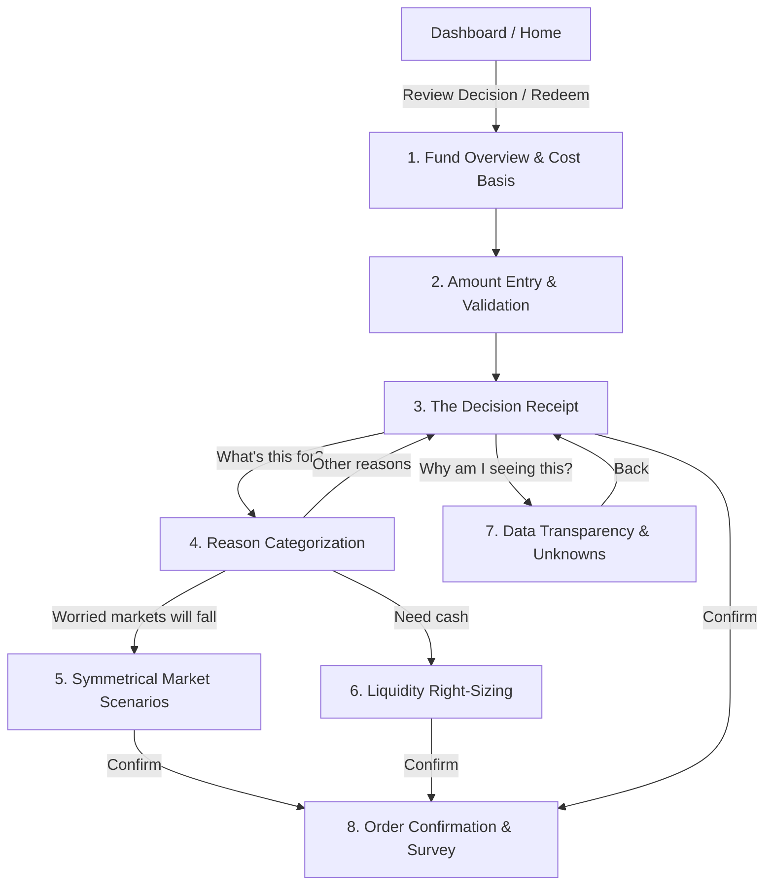

<div align="center">

# 📊 FinLit Ventures
### *Behavioral Finance & Decision Intelligence Layer for Retail Mutual Funds*

[](https://react.dev/)
[](https://www.typescriptlang.org/)
[](https://vitejs.dev/)
[](https://tailwindcss.com/)
[](LICENSE)

<br />

> **“Code computes · AI explains · Validator checks · Investor decides.”**  
> *FinLit introduces intentional friction and mathematical transparency into retail mutual-fund redemptions to counter panic-selling, loss aversion, and goal derailment.*

</div>

---

## 📖 Table of Contents
- [Overview](#-overview)
- [The Behavioral Finance Thesis](#-the-behavioral-finance-thesis)
- [Key Features & Innovations](#-key-features--innovations)
- [Redemption Intervention Workflow](#-redemption-intervention-workflow)
- [Architecture & Tech Stack](#-architecture--tech-stack)
- [Project Structure](#-project-structure)
- [Getting Started](#-getting-started)
- [Design System & Aesthetics](#-design-system--aesthetics)
- [Roadmap](#-roadmap)
- [License](#-license)

---

## 💡 Overview

Conventional mutual fund distribution and broking platforms prioritize **frictionless execution**—streamlining one-click redemption flows that encourage impulsive exits during cyclical market downturns. 

**FinLit** is built on the opposite philosophy: **Intentional Friction & Explainable Awareness**. When an investor initiates a withdrawal, FinLit intercepts the order with a deterministic mathematical engine that computes:
1. **Realized Capital Loss vs. Gains** under Indian mutual fund taxation rules (FIFO ledger units).
2. **Dynamic Asset Allocation Shift** (e.g., equity exposure drifting from 78% to 76%).
3. **Milestone Goal Derailment** (e.g., immediate rupee reduction on target home purchase timeline).
4. **Symmetrical Market Scenarios** (framing the cost of re-entry vs. downside protection).

FinLit never gives prescriptive buy/sell recommendations—it empowers investors with **uncompromising mathematical clarity**.

---

## 🧠 The Behavioral Finance Thesis

Retail investors consistently underperform market benchmarks due to psychological biases:
* **Panic Selling (Myopic Loss Aversion):** Experiencing acute anxiety during drawdowns and redeeming at market troughs.
* **The Re-entry Trap:** Exiting during a correction creates a secondary, harder dilemma: *when to buy back in*.
* **Tax Invisibility:** Failing to understand whether an exit realizes a capital loss, triggers exit loads, or incurs tax under Section 112A.
* **Goal Disconnect:** Viewing portfolio withdrawals as isolated rupee transactions rather than subtractions from life milestones (e.g., a child's education or a home deposit).

FinLit translates raw numbers into tangible life consequences **before** any transaction is executed.

---

## ✨ Key Features & Innovations

### 1. 🧾 The "Decision Receipt" Pattern (`Screen3Receipt.tsx`)
Replaces the standard generic checkout screen with an exhaustive, multi-dimensional audit receipt:
* **What You Get:** Clear net credit amount and expected bank settlement timeline.
* **What It Costs:** FIFO purchase cost basis, realized profit/loss, exit load status, and capital gains tax estimation.
* **What It Affects:** Exact rupee impact on primary goals and portfolio asset mix.
* **What We Don't Know:** Honest, explicit declaration of variables outside the platform (external emergency reserves, outside assets).

### 2. ⚖️ Symmetrical Market Scenarios (`Screen5MarketWorry.tsx`)
When a user selects *"Worried markets will fall"* as their motive, FinLit presents balanced, unbiased math:
* **If the fund falls 10%:** Shows capital protected (e.g., avoids ~₹8,000 decline).
* **If the fund rises 10%:** Shows the cost of re-entry (e.g., purchasing the same units will cost ~₹8,000 more).

### 3. 🎯 Life Milestone Trajectory Engine (`InsightsScreen.tsx`)
Tracks portfolio capital across distinct life goals:
* **Home — 2031:** Dynamic recalculation showing funded capital delta (₹7.06L → ₹6.26L).
* **Higher Education — 2029:** Monitored milestone progress.
* **Emergency Reserve — 2026:** Liquid safety buffer tracking.

### 4. 🔍 Explainable Intelligence Layer (`AIExplanationModal.tsx`)
Every financial figure in the UI features an **"Explain arithmetic"** inspector:
* Exact mathematical formulas used.
* Authoritative data sources (AMFI Daily NAV, Consolidated Account Statements, CAMS/KFintech records).
* Mathematical validation guarantees (deterministic 0% deviation proofs).

### 5. 🛡️ Tamper-Evident Audit Trail (`ActivityScreen.tsx`)
Chronological record of every decision receipt created, allocation recalculated, and redemption confirmed, creating total transparency for the investor.

---

## 🔄 Redemption Intervention Workflow



---

## 🛠️ Architecture & Tech Stack

| Technology | Purpose | Implementation Details |
| :--- | :--- | :--- |
| **React 18** | UI Framework | Functional components with custom hooks (`useFinLit`) |
| **TypeScript** | Type Safety | Strict typing across financial models and payloads |
| **Vite 5** | Build Tool | Sub-second HMR and optimized production bundling |
| **Tailwind CSS 3** | Styling | Custom typography tokens and warm financial palette |
| **Lucide React** | Icons | High-contrast financial iconography |
| **React Context** | State Management | `FinLitContext` manages flows, tabs, and notifications |
| **Supabase Client** | Backend Ready | `@supabase/supabase-js` ready for live cloud storage |

---

## 📂 Project Structure

```
d:/avani project/
├── index.html                   # HTML entry point with Inter font optimization
├── package.json                 # Project dependencies & build scripts
├── tailwind.config.js           # Warm color palette & typography tokens
├── vite.config.ts               # Vite configuration with alias mapping (@/)
└── src/
    ├── App.tsx                  # Main application router with ErrorBoundary
    ├── main.tsx                 # Root React DOM bootstrap
    ├── index.css                # Base stylesheet and tabular numerical utilities
    ├── context/
    │   └── FinLitContext.tsx    # Central state provider (navigation, data, modals)
    ├── lib/
    │   └── data.ts              # Deterministic financial calculation engine
    ├── components/
    │   ├── layout/
    │   │   ├── AppShell.tsx     # Responsive page frame
    │   │   ├── TopNav.tsx       # Scroll-responsive sticky navigation bar
    │   │   └── BottomNav.tsx    # Mobile tab navigation
    │   ├── modals/
    │   │   ├── AIExplanationModal.tsx    # Mathematical proof & explanation modal
    │   │   ├── WhyAmISeeingModal.tsx     # Algorithm disclosure & data transparency
    │   │   ├── NotificationCenterModal.tsx# Actionable alerts & deep links
    │   │   └── SettingsModal.tsx         # Notification preferences & trust center
    │   └── ui/
    │       ├── ActionPair.tsx   # Dual primary/secondary buttons
    │       ├── AmountDisplay.tsx# Large formatted currency numerals
    │       ├── Button.tsx       # High-contrast action buttons
    │       ├── Chip.tsx         # Interactive multi-choice chips
    │       ├── ErrorBoundary.tsx# Crash protection & graceful recovery
    │       ├── MetricRow.tsx    # Data metric rows
    │       ├── ScreenShell.tsx  # Flow screen scaffolding
    │       └── Toast.tsx        # Ephemeral alert messages
    └── screens/
        ├── HomeScreen.tsx       # Portfolio overview & pending decision alert
        ├── PortfolioScreen.tsx  # CAS holdings & asset mix drift simulator
        ├── InsightsScreen.tsx   # Life goal milestones & 52-week drawdown context
        ├── ActivityScreen.tsx   # Chronological financial audit trail
        ├── Screen1Fund.tsx      # Step 1: Fund context & cost basis
        ├── Screen2Amount.tsx    # Step 2: Amount input with ceiling checks
        ├── Screen3Receipt.tsx   # Step 3: Decision Receipt
        ├── Screen4Reason.tsx    # Step 4: Intent categorization
        ├── Screen5MarketWorry.tsx# Step 5: ±10% market scenario analysis
        ├── Screen6NeedCash.tsx  # Step 6: Cash requirement right-sizing
        ├── Screen7Explainability.tsx # Step 7: Data transparency & unknowns
        └── Screen8Completion.tsx# Step 8: Order confirmation & feedback survey
```

---

## 🚀 Getting Started

### Prerequisites
* **Node.js** (v18.0.0 or higher recommended)
* **npm** (v9.0.0 or higher)

### Installation

1. **Clone the repository:**
   ```bash
   git clone https://github.com/AvaniJain12-tech/finlit.git
   cd finlit
   ```

2. **Install dependencies:**
   ```bash
   npm install
   ```

3. **Start the development server:**
   ```bash
   npm run dev
   ```
   Open [http://localhost:5173](http://localhost:5173) in your browser.

4. **Run TypeScript type validation:**
   ```bash
   npm run typecheck
   ```

5. **Build for production:**
   ```bash
   npm run build
   ```

---

## 🎨 Design System & Aesthetics

FinLit adopts a calm, warm, and trustworthy visual identity specifically engineered to reduce financial anxiety:

* **Background (`#F7F6F2`):** Warm linen background avoiding harsh digital whites.
* **Surface (`#FFFFFF`):** High-contrast cards with subtle borders (`#E5E2DA`).
* **Ink (`#171717`):** Deep neutral typography for maximum legibility.
* **Accent (`#C2672B`):** Warm terracotta and honey amber tones, intentionally replacing alarming generic reds.
* **Tabular Numbers (`tnum`):** Zero-jitter rendering for dynamic financial figures.
* **Scroll-Aware Navigation:** Header retracts on downward scroll to maximize content focus and smoothly re-appears on upward scroll.

---

## 🗺️ Roadmap

- [x] **Hero Intervention Flow**: 8-step friction sequence with Decision Receipt.
- [x] **Mathematical Engine**: Deterministic FIFO P/L, tax estimation, and asset drift.
- [x] **Dynamic Goal Tracking**: Real-time milestone funding recalculation.
- [x] **Defensive Resilience**: Global `ErrorBoundary` to prevent blank screen crashes.
- [ ] **Live Supabase Persistence**: Connect database tables for multi-user session storage.
- [ ] **CAS PDF Parser**: Allow investors to upload real CAMS/KFintech eCAS statements.
- [ ] **URL Routing**: Implement React Router / query-param state sharing.

---

## 📄 License

This project is licensed under the **MIT License**. See the [LICENSE](LICENSE) file for details.

---

<div align="center">
  <sub>Built with ❤️ for informed, calm, and financially literate investing.</sub>
</div>
